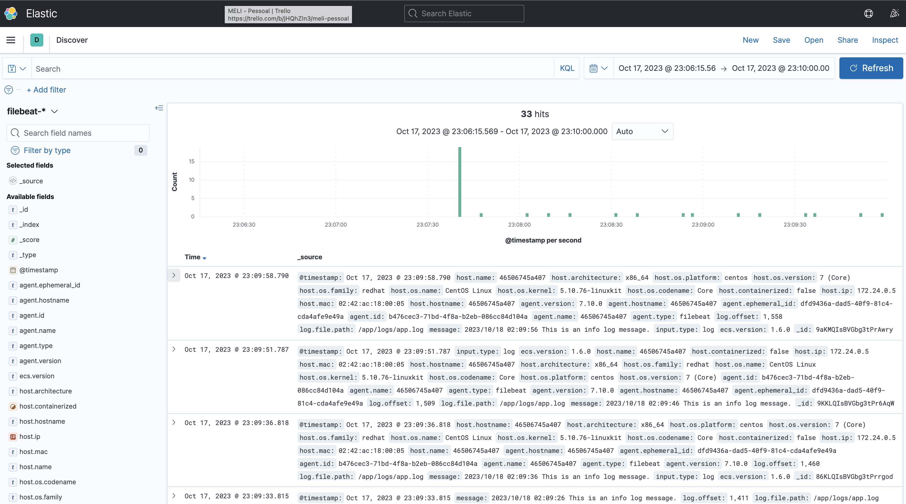
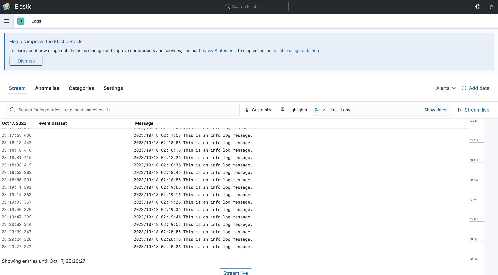

# Golang + Elastic Search + Kibana
Esse repositório contém uma demonstração da integração da stack Elastic Search e Kibana. A aplicação de exemplo foi desenvolvida em Golang.

## Pré Requisitos
Ferramentas que você precisará para construir sua aplicação:
- Docker
- Go 1.21

## Executando a Stack
```
docker-compose up --build
```
## Visualização dos logs
Acesse o endereço abaixo:
```
http://localhost:5601
```
Acesse o menu `Kibana > Discovery` ou `Observability > Logs`

## Screenshots

